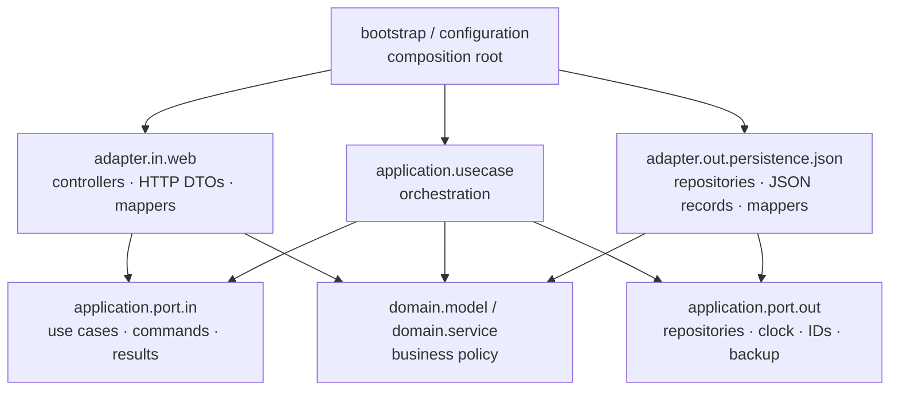
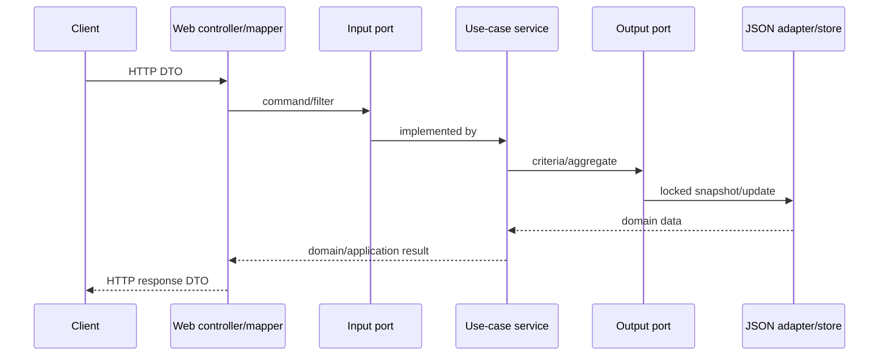

# Backend architecture contributor guide

## Dependency rule and packages

The backend uses Clean Architecture with DDD tactical patterns. Dependencies point inward: **adapters → application → domain**. The domain owns policy, the application owns use cases and ports, adapters translate technologies, and `configuration` is the composition root.

| Package | Allowed dependencies |
| --- | --- |
| `domain.model`, `domain.service` | JDK and `domain` only; never application, adapters, configuration, Spring, Jakarta, or Jackson |
| `application.port.*`, `application.usecase`, `application.exception` | JDK, domain, and application; never adapters, configuration, Spring/Jakarta, or Jackson |
| `adapter.in.web` | input ports/commands/results, domain, its own DTOs/mappers, Spring/Jakarta web APIs; never use-case implementations, outbound adapters, or configuration |
| `adapter.out.persistence[.json]` | output ports, domain, application persistence/import exceptions, its records/mappers and Jackson/filesystem APIs; never input ports, web, use-case implementations, or configuration |
| `configuration` and bootstrap | any layer only to wire objects/framework behavior; no business policy |

Architecture tests encode these boundaries. Introduce an inward-owned abstraction instead of granting an inner layer an exception.

## Domain model and invariants

`InvestmentEntry` and `InvestmentOperation` are immutable aggregate roots. Each repository changes one aggregate at a time. There are no independently mutable child entities. `PortfolioHistory` groups selected data for calculation and `PortfolioPerformance` is a domain result, not a stored aggregate.

Value objects include both ID types, `OwnerId`, `Money`, `AssetCategory`, `AssetKey`, `ValuationDate`, `ValuationSnapshot`, and `CashFlow`; enums are domain vocabulary. `PortfolioPerformanceCalculator` and `RateOfReturnCalculator`/`NumericalRateOfReturnCalculator` are pure domain services.

Constructors/factories and reconstitution must enforce the same invariants: required IDs/category/owner/dates/timestamps; lowercase stable owner IDs; type/subcategory compatibility in `AssetCategory`; two-decimal half-up PLN normalization and sign rules in `Money`; update time not before creation; positive operation amount; non-negative fee/tax; and a trimmed note no longer than 250 characters. The backup requires its supported version and the store additionally enforces unique IDs per aggregate collection. Domain code contains no Bean Validation, JSON, persistence DTO, HTTP, or repository concerns.

## Input/output ports and use cases

Capability interfaces named `...UseCase`, transport-neutral `...Command` values, filters, and results live in `application.port.in`. Controllers depend on those interfaces, never implementations. `application.usecase` orchestrates domain behavior and output ports and does not parse HTTP/JSON. Prefer one public operation per focused port; a cohesive class may implement related ports.

The application owns output abstractions in `application.port.out`: repositories and criteria, `Clock`, `IdGenerator`, `OwnerDirectory`, backup port, and unit of work. They speak domain/application vocabulary. Adapters implement them; inner code never imports an adapter. Commands are immutable and domain construction remains the final validation boundary.

## Web, persistence, DTOs, and mappers

The web adapter owns routes, status codes, binding, Bean Validation, multipart/headers, error shape, and conversion. `*Request`, `*Response`, and `*WebMapper` remain in `adapter.in.web`. Persistence records must never become API DTOs.

The JSON adapter owns filesystem/Jackson mechanics, locking, format and legacy reading, atomic replacement, repository ordering, and domain mapping. Package-private `*JsonRecord` documents and `*JsonMapper` classes remain in `adapter.out.persistence.json`; no Jackson type crosses a port.

## Exceptions and HTTP translation

The detecting layer owns failure vocabulary. Domain not-found/invariant exceptions stay in the domain; import and persistence failures live in `application.exception`; technology exceptions are wrapped by adapters. Only `ApiExceptionHandler` translates to HTTP: invalid input/malformed import to `400`, missing aggregates to `404`, and persistence failure to sanitized `500`. Inner layers never use HTTP exceptions or statuses.

## Time, UUIDs, and external services

Use application output ports `Clock` for current `Instant`/UTC date and `IdGenerator` for UUIDs. Production `Instant::now` and `UUID::randomUUID` implementations are selected in configuration; tests inject deterministic fakes. Direct time access is permitted only for transport/operational metadata, not domain decisions or use cases.

Every network, broker, market-data, mail, or other external integration needs an application-owned output port and outbound adapter. Vendor types remain in that adapter and are mapped to domain values before business decisions.

## Transaction boundaries

A use-case call is the transaction boundary. `JsonInvestmentStore.update` locks the normalized path in this JVM, reads the whole document, applies and validates one change, writes a temporary file, and atomically replaces the live file. Import validates before locked replacement; export uses one locked snapshot. Both repositories share the store/`InvestmentUnitOfWork`, preserving consistent entry and operation collections. For multi-write atomic behavior, extend the unit-of-work port rather than sequencing repository writes.

The lock does not coordinate processes or hosts. JSON offers neither database isolation nor indexes/cross-process transactions.

## Test expectations

* **Domain unit:** construct domain objects/services directly; cover boundaries, every invariant, and calculation statuses without Spring/filesystem.
* **Use-case:** invoke input ports with fake repositories, clock, IDs, and services; verify orchestration, criteria, not-found behavior, and transaction intent.
* **Adapter contract:** apply reusable port contracts to every repository implementation, including CRUD, filters, ordering, preservation, and errors.
* **Integration:** exercise HTTP binding/error translation and wired JSON behavior using temporary files; add Spring end-to-end tests for configuration crossings.
* **Architecture:** protect inward dependencies, port/adapter separation, framework-free inner layers, and controller/DTO/mapper placement. Change `ArchitectureTest` only with this policy.

Run `mvn test` from the repository root. Behavior changes need tests at the lowest useful level and affected contract/integration levels.

## Naming and worked use-case example

Use `...UseCase` (input port), `...Command`/`...Result` (application messages), `...Repository`/`...Port` (output), `...Service` or cohesive `...UseCase` (implementation), `...Controller`/`...Request`/`...Response`/`...WebMapper` (HTTP), and `Json...Repository`/`...JsonRecord`/`...JsonMapper` (JSON). Criteria belong to output ports; filters to input ports.

Example: add **rename an operation note**.

1. Add invariant-preserving `InvestmentOperation.renameNote(...)` and domain tests.
2. Add `RenameInvestmentOperationCommand` and `RenameInvestmentOperationUseCase` under `application.port.in`.
3. Implement it in `application.usecase`: load through `InvestmentOperationRepository`, throw the domain not-found exception, apply domain behavior, and save once. Use `Clock` only if “now” matters.
4. If persistence vocabulary is insufficient, extend the output port, JSON adapter, and repository contract—never import the adapter into the service.
5. Add a web request and mapper/controller operation, reusing the response DTO. Translate only genuinely new error categories.
6. Wire it in `ApplicationConfiguration`; add use-case and web/integration tests and run architecture tests.

## ADR: Clean Architecture/DDD packages and JSON persistence

**Status:** Accepted. We organize one Spring Boot deployable by inward-facing packages. Domain objects enforce validity, application ports form stable seams, adapters contain volatile transport/persistence details, and explicit configuration composes them. This enables framework-free tests and persistence replacement, at the cost of ports, DTOs, and mapping code.

JSON was selected for simple local deployment, readable backups, and atomic whole-document replacement. One versioned document containing both aggregate collections makes export/import and single-process consistency straightforward and permits legacy entry-array migration. Tradeoffs are whole-file I/O, an in-JVM-only lock, no cross-process concurrency, limited querying/scalability, and explicit migration/validation. Adopt a transactional database adapter when volume, concurrent writers, partial updates, or recovery needs dominate, while preserving the ports and domain semantics.
